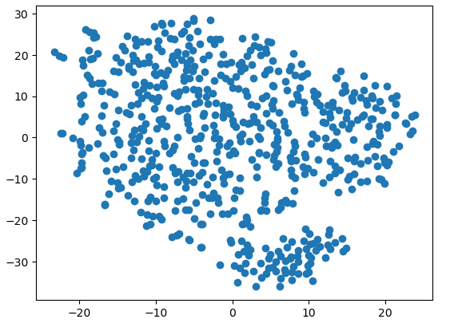
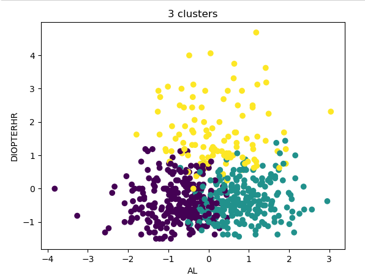
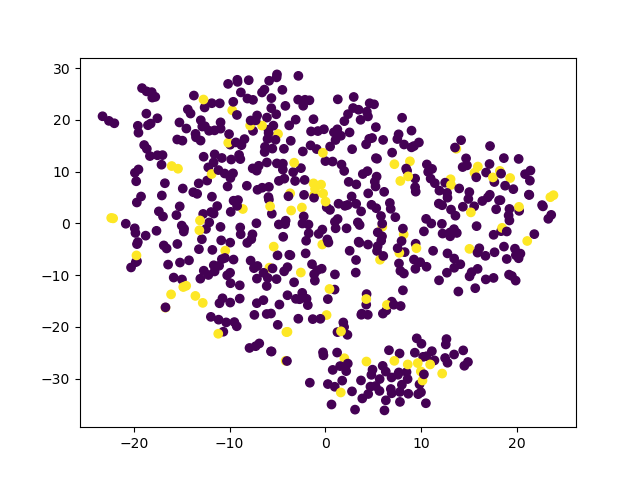
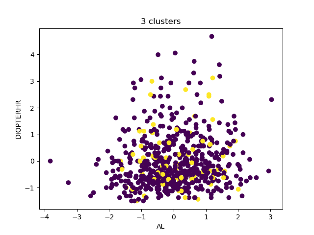

#   **Module 20 Unsupervised Machine Learning Challenge**  
### Chris Gruenhagen 20Feb2023
---

## **Purpose**

    You are on the data science team of a medical research company that’s interested in finding better ways to predict myopia, or nearsightedness. Your team has tried—and failed—to improve their classification model when training on the whole dataset. However, they believe that there might be distinct groups of patients that would be better to analyze separately. So, your supervisor has asked you to explore this possibility by using unsupervised learning.

    Clean the data and use unsupervised learning to determine whether the myopia patients can be grouped for further analysis.  

## **Process**
 
### ***Prepare Data***
    The Myopia dataset contains diagnosis classification information (Myopic column) that was removed to use the dataset for unsupervised learning.  
    Data was checked for categorical data, duplicates, and nulls. No cleaning required.
    Data was scaled using Standard Scaler and saved to "MyopiaCleanData.csv".

### ***Reduce Dimensions***
    Scaled data dimensions were reduced from 14 to 9 using PCA while retaining 92% of the explained variance. 

    The Scaled PCS reduced data dimensions were further reduced from 9 to 2 using t-SNE at two learning rates (35 and 80).  Each t-SNE analysis was run 5x to evaluate run to run variability. Charted data varies from run to run, but seems to show two separate clusters of data. 

### ***Cluster Analysis***
    Scaled data was evaluated using an elbow curve to identify the best number of clusters to use for analysis. There is a slight elbow at three clusters.

    The K-means model was fit with n_clusters = 3 and random_state = 0 and the data was plotted for features "AL" and "DIOPTERHR".

## **Results**

### ***PCA t-SNE Dimension Reduction***

The PCA/t-SNE dimension reduction resulted in one large cluster and one small cluster in the 2D space.

### ***K-means Cluster Analysis***

The K-means model (k=3) produced three visually distinct clusters.

## **Conclusion**

    The myopia patient data can be grouped using PCA/t-SNE or K-means for further analysis.

## **Today I learned**
    Even though the data can be grouped for further analysis, these groupings do not correspond with the actual clinical diagnosis as listed in the "Myopic" column from the original data (represented by yellow and purple in the charts below).  

### ***PCA t-SNE Dimension Reduction colored by Myopic diagnosis***

t-SNE is a dimension reduction tool to allow for visualization of multi-dimensional data in 2D or 3D and is not a classification tool.  

### ***K-means Cluster Analysis colored by Myopic diagnosis***

K-means is a clustering tool that maximizes between-cluster distances and is not a classification tool.

---

# **Start a Data Preparation Cheat Sheet**
Data Preparation Cheat Sheet
1. check datatypes (numeric cols may have non-numeric info that needs to be removed, data types may need to be changed) 
    df.dtypes

2. replace categorical with numeric values - consider replacing empty strings with NaN 
    https://www.geeksforgeeks.org/how-to-convert-categorical-variable-to-numeric-in-pandas/

    df['colname'].unique()
    df['colname'].replace(['uniquevalue1', 'uniquevalue2','uniquevalue3',''],
                        [1,2,3,0], inplace=True)

    OR
    
    dummies = pd.get_dummies(df.colname)
    merged = pd.concat([df,dummies].axis='columns')
    merged.drop('colname',axis='columns')

    OR (example from homework Mod20-Day1-Activity02)

    df['colname'].unique()
    colname_dict = {'uniquevalue1': 1, 'uniquevalue2': 2, 'uniquevalue3': 3}
    df2 = df.replace({'colname': colname_dict})
     note: not sure how this would handle a null

    OR (example from homework Mod20-Day1-Activity03)

    def changeChannel(channel):
        if channel == "uniquevalue1":
            return 1
        if channel == "uniquevalue2":
            return 2
        if channel == "uniquevalue3":
            return 2        
        else:
            return 0 
    df_shopping["Channel"] = df_shopping["Channel"].apply(changeChannel)

3. check for nas, nulls and remove if necessary  (na = NOT A NUMBER)  NOTE: df.isna() == df.isnull()  
    https://pandas.pydata.org/docs/reference/api/pandas.DataFrame.dropna.html

    df.isna().sum()
    df.dropna() 

    NOTE: This does not detect empty strings.  To detect empty strings search for df['colname']==''
    https://stackoverflow.com/questions/27159189/find-empty-or-nan-entry-in-pandas-dataframe

4. check for duplicate values and remove if necessary
    https://pandas.pydata.org/docs/reference/api/pandas.DataFrame.drop_duplicates.html

    df.duplicated().sum()
    df.drop_duplicates(keep='first')  note: keep = 'first' is default

5. drop unnecessary columns 
    https://www.w3schools.com/python/pandas/ref_df_drop.asp#:~:text=The%20drop()%20method%20removes

    df.drop(columns=['colname'])
    or
    df.drop('colname',axis = 1)
    df.drop('colname',axis = 'columns')

6. standardize dataset so larger numbers don't influence the outcome more
    Scale the data - all columns (example from homework Mod20-Day1-Activity06)
        df_scaled = StandardScaler().fit_transform(df)

    Scale the data - subset of columns (example from homework Mod20-Day1-Activity03)
        from sklearn.preprocessing import StandardScaler
        scaler = StandardScaler()
        scaled_data = scaler.fit_transform(df_shopping[['Fresh', 'Milk', 'Grocery', 'Frozen', 'Detergents_Paper', 'Delicatessen']])

        If you need to add back a column that wasn't part of the scaling (was already 0,1)

        # A list of the columns from the original DataFrame
        df_shopping.columns

        # Create a DataFrame with the transformed data
        new_df_shopping = pd.DataFrame(scaled_data, columns=df_shopping.columns[1:])
        new_df_shopping['Channel'] = df_shopping['Channel']
        new_df_shopping.head()

---

# 👓 👀 🔢 📈 &#x1F469;&#x200d;&#x1F4bb; 📉 🔢 👀 👓
     emoji & format references:
        https://emojipedia.org
        https://commons.wikimedia.org/wiki/Emoji/Table
        https://www.markdownguide.org/basic-syntax/

        
***See below for original homework instructions***
#  Module 20 Unsupervised Machine Learning Challenge
Due Feb 27, 2023 by 11:59pm 

Points 100 

Submitting a text entry box or a website url
_________________________________________________________
##  **Background**  

You are on the data science team of a medical research company that’s interested in finding better ways to predict myopia, or nearsightedness. Your team has tried—and failed—to improve their classification model when training on the whole dataset. However, they believe that there might be distinct groups of patients that would be better to analyze separately. So, your supervisor has asked you to explore this possibility by using unsupervised learning.

You have been provided with raw data, so you’ll first need to process it to fit the machine learning models. You will use several clustering algorithms to explore whether the patients can be placed into distinct groups. Then, you’ll create a visualization to share your findings with your team and other key stakeholders.

##   **Before You Begin** 

1. Create a new repository for this project called unsupervised-machine-learning-challenge. Do not add this Challenge to an existing repository.
2. Clone the new repository to your computer.

##   **Files** 

Download the following files to help you get started:

<a href = "https://static.bc-edx.com/data/dl-1-1/m20/lms/starter/Starter_Code_v1.zip " target = "_blank"> Module 20 Challenge files </a>

##    **Instructions** 

This activity is broken down into four parts:
* Part 1: Prepare the Data
* Part 2: Apply Dimentionality Reduction
* Part 3: Perform a Cluster Analysis with K-means
* Part 4: Make a Recommendation

### ***Part 1: Prepare the Data***
1. Read myopia.csv into a Pandas DataFrame.

    Note: This file can be found in your Module 20 Challenge files.

2. Remove the "MYOPIC" column from the dataset.

     Note: The target column is needed for supervised machine learning, but it will make an unsupervised model biased. After all, the target column is effectively providing clusters already!

3. Standardize your dataset so that columns that contain larger values do not influence the outcome more than columns with smaller values.

### ***Part 2: Apply Dimensionality Reduction***
1. Perform dimensionality reduction with PCA. How did the number of the features change?

    Hint: Rather than specify the number of principal components when you instantiate the PCA model, state the desired explained variance. For example, say that a dataset has 100 features. Using PCA(n_components=0.99) creates a model that will preserve approximately 99% of the explained variance, whether that means reducing the dataset to 80 principal components or 3.

    For this assignment, preserve 90% of the explained variance in dimensionality reduction.
2. Further reduce the dataset dimensions with t-SNE and visually inspect the results. To do this, run t-SNE on the principal components, which is the output of the PCA transformation.

3. Create a scatter plot of the t-SNE output. Are there distinct clusters?

### ***Part 3: Perform a Cluster Analysis with K-means***
Create an elbow plot to identify the best number of clusters. Make sure to do the following:

* Use a for loop to determine the inertia for each k between 1 through 10.

* If possible, determine where the elbow of the plot is, and at which value of k it appears.

### ***Part 4: Make a Recommendation***
Based on your findings, write up a brief (one or two sentences) recommendation for your supervisor in your Jupyter Notebook. Can the patients be clustered? If so, into how many clusters?

##   **Requirements** 
### ***Data Preparation (25 points)***
* Reads the csv into pandas (5 points)
* Previews the DataFrame (5 points)
* Removes the MYOPIC column from the dataset (5 points)
* Standardizes the dataset using a scaler (5 points)
* Names the resulting DataFrame X (5 points)

### ***Dimensionality Reduction (40 points)***
* PCA model is created and used to reduce dimensions of the scaled dataset (10 points)
* PCA model’s explained variance is set to 90% (0.9) (5 points)
* The shape of the reduced dataset is examined for reduction in number of features (5 points)
* t-SNE model is created and used to reduce dimensions of the scaled dataset (10 points)
* t-SNE is used to create a plot of the reduced features (10 points)

### ***Clustering (30 points)***
* A K-means model is created (10 points)
* A for- loop is used to create a list of inertias for each k from 1 to 10, inclusive (5 points)
* A plot is created to examine any elbows that exist (10 points)
* States a brief (1-2 sentence) conclusion on whether patients can be clustered together, and supports it with findings (10 points)

##  **References**  
Reduced dataset from Orinda Longitudinal Study of Myopia conducted by the US National Eye InstituteLinks to an external site.

© 2023 edX Boot Camps LLC
